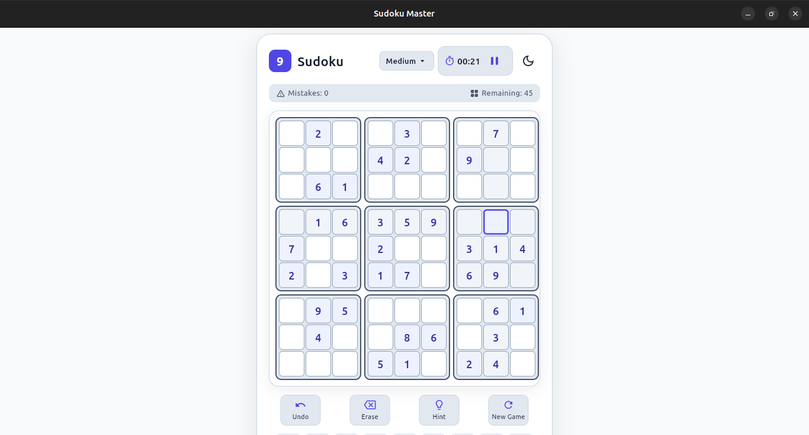
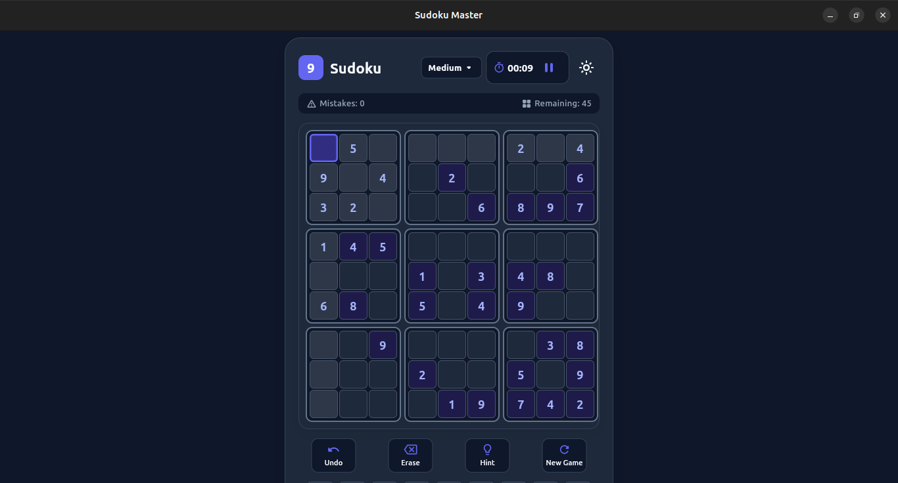

# Sudoku (Python + Flet)

Desktop Sudoku game with generated puzzles that always have exactly one solution. Project 4 of my [Python project series](../README.md).

<p align="center">
  
  
</p>

## What it does

- Generates a full valid board with recursive backtracking, then removes cells while checking the puzzle still has one solution
- Four difficulty levels: Easy, Medium, Hard, Expert
- Undo (history stack), erase, hint, new game
- Live timer with pause/resume
- Full keyboard control: `1`-`9` enter, `Backspace`/`Delete` clear, arrows move, `Ctrl+Z` undo, `h` hint, `n` new game
- Row/column/box and matching-number highlighting
- Light and dark theme
- Win dialog with time, difficulty and mistake count

## Run it

Tested on Python 3.12.3.

```bash
git clone https://github.com/maadan-dev/python-project-series.git
cd python-project-series/04-sudoku-game
python -m venv .venv
source .venv/bin/activate        # Windows: .venv\Scripts\activate
pip install -r requirements.txt  # flet==1.0.2
python main.py
```

## Structure

```text
04-sudoku-game/
├── board.py         # board state, index validation, getters/setters, reset
├── validation.py    # row/column/box rules, is the board solved
├── generator.py     # backtracking generator, solution counter, cell removal
├── gui.py           # Flet UI, theme palette, event handlers, timer, keyboard
├── main.py          # entry point
└── requirements.txt
```

Game logic (`board.py`, `validation.py`, `generator.py`) has no Flet imports. Only `gui.py` touches the UI.

## What I built by hand vs with AI

- **Hand-written:** `board.py`, `validation.py`, `generator.py`, core of `gui.py` (cell input, new game logic, grid initialization)
- **AI-assisted:** theme palette (`Palette`), subgrid layout polish, keyboard navigation listeners, numpad remaining-count badges, hint solver integration in `gui.py`

## What I learned

- **Recursive backtracking:** try a value, recurse, undo on failure. See `sudoku_generator` in [`generator.py`](generator.py)
- **Uniqueness checking:** `count_solutions` counts every solution reachable from a partial board, and `remove_cells` only keeps a removal if the count stays at 1. See [`generator.py`](generator.py)
- **Logic separate from UI:** the game rules never import Flet, so they can be reasoned about (and later tested) without a window. See [`validation.py`](validation.py)
- **Redrawing from state:** `update_board_visuals` in [`gui.py`](gui.py) rebuilds the display from board state instead of patching cells one by one
- **Undo as a stack:** `append` on each move, `pop` to revert. See `undo_move` in [`gui.py`](gui.py)
- **Closures capture by reference:** why grid callbacks need `lambda e, r=row, c=col: ...` instead of using `row` and `col` directly

## What broke, and what fixed it

- **Generator produced the same grid every game:** it tried 1..9 in fixed order, so only the removed cells varied. Found in code review, not by testing. Fixed by shuffling candidate numbers per cell in `sudoku_generator`.
- **`remove_cells` could loop forever** if no more cells could be removed without breaking uniqueness: fixed by capping the removal loop and having `count_solutions` stop as soon as it finds 2 solutions.
- **`is_board_solved` false negatives:** each cell was compared against itself and reported a conflict. Fixed by skipping the cell's own coordinates in `is_valid`.
- **Didn't understand why callbacks used `r=row, c=col`:** traced it until I understood that closures capture variables by reference, so every lambda would otherwise see the last loop value.
- **Passing `Board` where a 2D list was expected (`board` vs `board.board`):** kept happening, so now I check the type entering every function.
- **`reset_board` reassigned a local instead of mutating state:** fixed by mutating `self.board` directly.
- **Flet 1.0.2 callback signatures** (`on_select` vs `on_change`) didn't match what I assumed. Read the method signatures instead of guessing.

## The recurring theme

I understand the concept, but lose track of what type is actually being passed around: `Board` object vs raw 2D list, `int` vs `str` from user input, function vs callback. Going forward: type hints on function signatures, checked with `pyright`, starting in project 5.

## Known limitations

- No automated tests yet
- Hint reveals the answer for free, with no score or time penalty
- Game state is not saved between restarts

## Next

Project 5: Invoice API (planned).